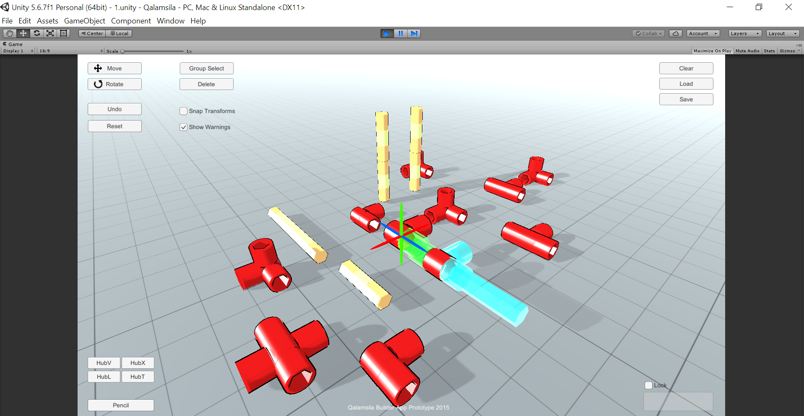

# 3d-contrusctor-unity3d
3d gadget builder prototype in Unity 3d C#

# Description

Prototype proof of concent app that is an editor for building 3d gadgets nodes together 
(4 Item samples are from Qalamsila project)

Compatible with Unity 5.6x

# Features

- View editor with mouse navigation
- Move, Rotate Widgets
- Place items in the 3d space and connect them
- Connect manager between items to detect if links are correctly placed without collision
- Copy, Paste and Undo
- Save and Load 
- Group select to auto select all gadget nodes physically connected together

# TODO

- Add inline code comments